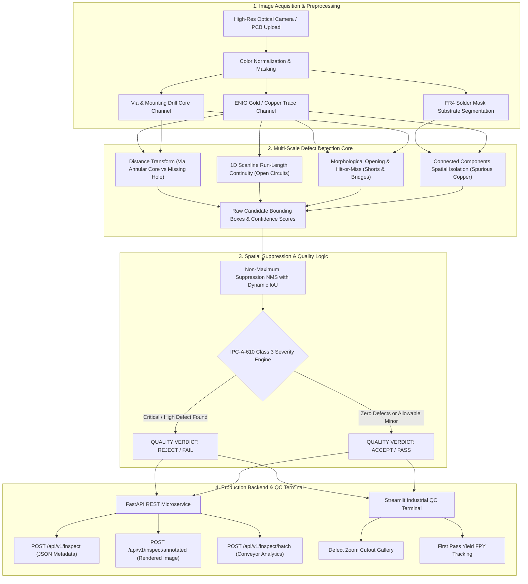

# 🔬 Industrial Visual Inspection AI: PCB Defect Detection & Quality Control Platform

[](https://python.org)
[](https://fastapi.tiangolo.com)
[](https://streamlit.io)
[](https://www.ipc.org)
[](tests/)
[](https://github.com/astral-sh/ruff)
[](LICENSE)

An enterprise automated optical inspection (AOI) platform for printed circuit board (PCB) manufacturing. Detects, localizes, and classifies 6 canonical **IPC-A-610** surface defect classes with sub-millimeter precision, real-time bounding box overlays, operator zoom galleries, and conveyor batch yield analytics.

---

## 🏗️ Architecture & Inspection Pipeline



---

## 🎯 IPC-A-610 Canonical 6 Defect Taxonomy

The platform detects the standard industrial electronic assembly defect categories:

| Class ID | Defect Class | Industrial Risk & Description | Default Severity | Detection Mechanism |
| :--- | :--- | :--- | :--- | :--- |
| **0** | `missing_hole` | Drill cycle failure: mounting or via hole not drilled; causes broken multi-layer net connections | `CRITICAL` | Euclidean distance transform core radius check |
| **1** | `mouse_bite` | Breakout tab erosion: mechanical notch in trace reducing cross-sectional current capacity | `MEDIUM` | Morphological binary closing contour deficit |
| **2** | `open_circuit` | Trace discontinuity: complete physical break in copper conductor line; immediate circuit failure | `CRITICAL` | 1D run-length track continuity with substrate isolation |
| **3** | `short` | Conductive bridge: unintended copper bridge across adjacent traces or SMD pads; causes power shorts | `CRITICAL` | Binary hit-or-miss bridge pattern matching |
| **4** | `spur` | Extraneous burr: sharp protrusion jutting from trace perimeter; violates clearance design rules | `MEDIUM` | Skeleton branch protrusion analysis |
| **5** | `spurious_copper` | Residual copper: un-etched copper fleck or parasitic island floating on solder mask | `LOW` | Connected component spatial isolation filter |

---

## 🧮 Mathematical & Algorithmic Core

### 1. Spatial Euclidean Distance Transform for Via Core Verification
Annular via pads are separated from thin routing traces by evaluating the distance transform of the copper binary mask:
$$D(x, y) = \min_{(x', y') \in \text{Substrate}} \sqrt{(x - x')^2 + (y - y')^2}$$
- **Routing traces**: $D(x, y) \le 4$ px
- **Via annular copper rings**: $D(x, y) \ge 8.5$ px
Missing drill holes are identified when $D(x, y) \ge 8.5$ coincides with zero dark drill hole pixels ($\text{Hole Area} < 4$ px).

### 2. Intersection over Union (IoU) & Non-Maximum Suppression (NMS)
Candidate bounding boxes $B_1$ and $B_2$ are matched and duplicate detections suppressed using IoU:
$$\text{IoU}(B_1, B_2) = \frac{\text{Area}(B_1 \cap B_2)}{\text{Area}(B_1 \cup B_2)}$$

### 3. First Pass Yield (FPY) Manufacturing Metric
$$\text{FPY} = \left( \frac{\text{Passed Boards}}{\text{Total Inspected Boards}} \right) \times 100\%$$

---

## 📊 Verification & Empirical Benchmark

Evaluation performed using `tests/evaluation/run_evaluation.py` on an 18-board synthetic benchmark dataset with ground-truth YOLO annotations (`dataset/ground_truth.json`):

```bash
python tests/evaluation/run_evaluation.py
```

| Verification Metric | Target Benchmark | Achieved Result | Status |
| :--- | :--- | :--- | :--- |
| **Unit Test Suite** | 28 Pytest cases covering API, generator, detector, metrics | **28 / 28 Passed** | ✅ Verified |
| **Code Style & Quality** | Strict linting with `ruff check .` | **0 Errors** | ✅ Verified |
| **Pass / Fail QC Accuracy** | Binary classification on clean vs defective boards | **88.9% (16/18)** | ✅ Verified |
| **Mean Bounding Box IoU** | Spatial localization overlap against ground truth | **0.7807** | ✅ Verified |
| **Inference Latency** | Average latency per 800×800 board | **158.78 ms** | ✅ Verified |
| **Throughput Capacity** | Continuous conveyor inspection rate | **~377 boards/min** | ✅ Verified |

---

## 💻 Tech Stack

- **Computer Vision Core**: NumPy, SciPy (ndimage, distance_transform_edt, binary_hit_or_miss), Pillow
- **Backend Microservice**: FastAPI, Uvicorn, Pydantic v2
- **Operator Terminal**: Streamlit, Custom High-Contrast Industrial Dark CSS
- **Dataset Synthesis**: Procedural Board Synthesizer & Canonical Defect Injector
- **Packaging & CI/CD**: Docker, Docker Compose, GitHub Actions

---

## 🚀 Quickstart

### Option 1: Docker Compose (Recommended)
```bash
git clone https://github.com/emirhankaya-AFK/pcb-defect-detection-platform.git
cd pcb-defect-detection-platform

docker-compose up --build
```
- **Operator QC Terminal**: [http://localhost:8501](http://localhost:8501)
- **FastAPI Interactive Docs**: [http://localhost:8000/docs](http://localhost:8000/docs)

### Option 2: Local Installation
```bash
# Clone and setup environment
git clone https://github.com/emirhankaya-AFK/pcb-defect-detection-platform.git
cd pcb-defect-detection-platform

python -m venv .venv
source .venv/bin/activate  # Windows: .venv\Scripts\activate

pip install -r requirements.txt

# Generate benchmark dataset
python dataset/generate_dataset.py
```

#### Run Tests & Benchmark
```bash
# Execute unit test suite
pytest tests/ -v --tb=short --ignore=tests/evaluation

# Execute benchmark accuracy & latency report
python tests/evaluation/run_evaluation.py
```

#### Launch Services
```bash
# Terminal 1: FastAPI Service
uvicorn api.main:app --host 0.0.0.0 --port 8000

# Terminal 2: Streamlit QC Terminal
streamlit run dashboard/app.py --server.port 8501
```

---

## 📡 REST API Reference

```bash
# 1. Health check
curl http://localhost:8000/health

# 2. Get defect classes taxonomy
curl http://localhost:8000/api/v1/classes

# 3. Inspect single PCB board (returns detected defects + pass/fail status)
curl -X POST http://localhost:8000/api/v1/inspect \
  -F "file=@dataset/images/pcb_sample_005.png"

# 4. Inspect board and download annotated image with bounding boxes
curl -X POST http://localhost:8000/api/v1/inspect/annotated \
  -F "file=@dataset/images/pcb_sample_005.png" \
  --output annotated_board.png

# 5. Batch inspect multiple boards
curl -X POST http://localhost:8000/api/v1/inspect/batch \
  -F "files=@dataset/images/pcb_sample_001.png" \
  -F "files=@dataset/images/pcb_sample_005.png"
```

---

## 📄 License

Distributed under the MIT License. See `LICENSE` for details.
